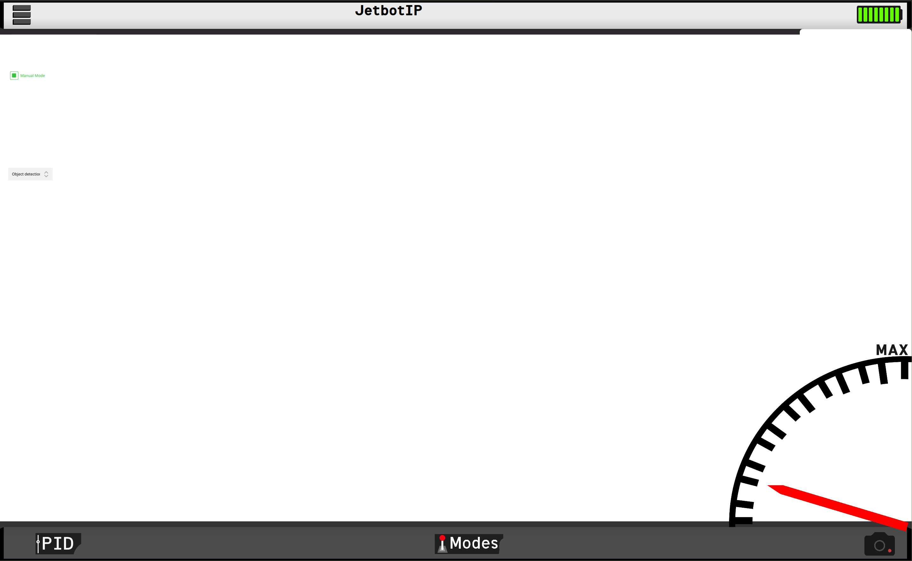

# Jetbot GUI
The goal of this project is to create a graphical user interface (GUI) that is useful when operating the Jetbot, providing an intuitive visual interface for control, monitoring, and potentially configuration.

## Features

* Toggle between manual control and autonomy mode.

* Displays Real-Time video

* Visualizes LiDAR measurements

#### Future features
* Display battery percentage
* Take Screenshots
* 

### Stack

* Frontend: Written in QML

* Backend: C++

* Graphical element is drawn in [Inkscape](https://inkscape.org/).

### Prerequisites

* A C++ compiler such as Clang, GCC or MSVC

* CMake 3.15 or higher

* Qt 6

### Configure and build
#### Linux:

> mkdir build 

> cd build && cmake ..  

> cd .. 

> cmake --build build

#### Code structure

##### Classes

* **Backend** - Connects the main logic to the frontend

* **JetBot** - Responsible for setting up all of the jetbot classes and create signals for 

* JetBot/JoystickHandler/**Joystick** - Scans for Joystick interfaces and updates updates all of the joystick axes

* JetBot/**JoystickHandler** - Transforms the joystick input into motion commands

* JetBot/**VideoReceiver** - Receives a UDP camera stream and sends it to the frontend.

* JetBot/**Server** - Enables communication of json data between the JetBot or Simulator.

